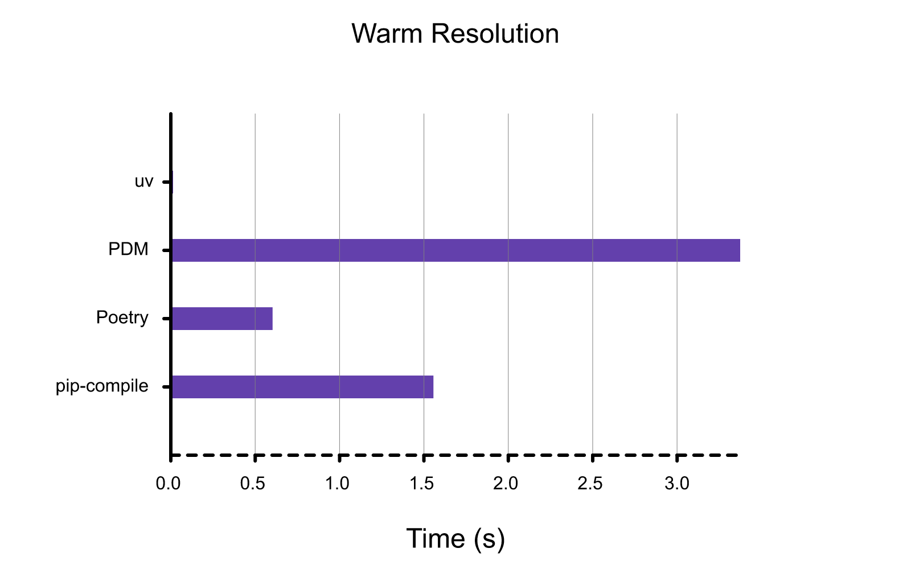

# Benchmarks

All benchmarks were computed on macOS using Python 3.12.0 (for non-uv tools), and come with a few
important caveats:

- Benchmark performance may vary dramatically across different operating systems and filesystems. In
  particular, uv uses different installation strategies based on the underlying filesystem's
  capabilities. (For example, uv uses reflinking on macOS, and hardlinking on Linux.)
- Benchmark performance may vary dramatically depending on the set of packages being installed. For
  example, a resolution that requires building a single intensive source distribution may appear
  very similar across tools, since the bottleneck is tool-agnostic.
- Unlike Poetry, both uv and pip-tools do _not_ generate platform-independent lockfiles. As such,
  Poetry is (by design) doing significantly more work than other tools in the resolution benchmarks.
  Poetry is included for completeness, as many projects may not _need_ a platform-independent
  lockfile. However, it's critical to understand that benchmarking uv's resolution time against
  Poetry is an unfair comparison. (Benchmarking installation, however, _is_ a fair comparison.)

This document benchmarks against Trio's `docs-requirements.in`, as a representative example of a
real-world project.

In each case, a smaller bar (i.e., lower) is better.

## Warm Installation

Benchmarking package installation (e.g., `uv pip sync`) with a warm cache. This is equivalent to
removing and recreating a virtual environment, and then populating it with dependencies that you've
installed previously on the same machine.


## Cold Installation

Benchmarking package installation (e.g., `uv pip sync`) with a cold cache. This is equivalent to
running `uv pip sync` on a new machine or in CI (assuming that the package manager cache is not
shared across runs).


## Warm Resolution

Benchmarking dependency resolution (e.g., `uv pip compile`) with a warm cache, but no existing
lockfile. This is equivalent to blowing away an existing `requirements.txt` file to regenerate it
from a `requirements.in` file.



## Cold Resolution

Benchmarking dependency resolution (e.g., `uv pip compile`) with a cold cache. This is equivalent to
running `uv pip compile` on a new machine or in CI (assuming that the package manager cache is not
shared across runs).


## Reproduction

All benchmarks were generated using the `scripts/benchmark` package, which wraps
[`hyperfine`](https://github.com/sharkdp/hyperfine) to facilitate benchmarking uv against a variety
of other tools.

The benchmark script itself has a several requirements:

- A local uv release build (`cargo build --release`).
- An installation of the production `uv` binary in your path.
- The [`hyperfine`](https://github.com/sharkdp/hyperfine) command-line tool installed on your
  system.

To benchmark resolution against pip-compile, Poetry, and PDM:

```shell
uv run resolver \
    --uv-pip \
    --poetry \
    --pdm \
    --pip-compile \
    --benchmark resolve-warm --benchmark resolve-cold \
    --json \
    ../requirements/trio.in
```

To benchmark installation against pip-sync, Poetry, and PDM:

```shell
uv run resolver \
    --uv-pip \
    --poetry \
    --pdm \
    --pip-sync \
    --benchmark install-warm --benchmark install-cold \
    --json \
    ../requirements/compiled/trio.txt
```

Both commands should be run from the `scripts/benchmark` directory.

After running the benchmark script, you can generate the corresponding graph via:

```shell
cargo run -p uv-dev render-benchmarks resolve-warm.json --title "Warm Resolution"
cargo run -p uv-dev render-benchmarks resolve-cold.json --title "Cold Resolution"
cargo run -p uv-dev render-benchmarks install-warm.json --title "Warm Installation"
cargo run -p uv-dev render-benchmarks install-cold.json --title "Cold Installation"
```

You need to install the [Roboto Font](https://fonts.google.com/specimen/Roboto) if the labels are
missing in the generated graph.

## Acknowledgements

The inclusion of this `BENCHMARKS.md` file was inspired by the excellent benchmarking documentation
in
[Orogene](https://github.com/orogene/orogene/blob/472e481b4fc6e97c2b57e69240bf8fe995dfab83/BENCHMARKS.md).

## Troubleshooting

### Flaky benchmarks

If you're seeing high variance when running the cold benchmarks, then it's likely that you're
running into throttling or DDoS prevention from your ISP. In that case, ISPs forcefully terminate
TCP connections with a TCP reset. We believe this is due to the benchmarks making the exact same
requests in a very short time (especially true for `uv`). A possible workaround is to connect to VPN
to bypass your ISPs filtering mechanism.
