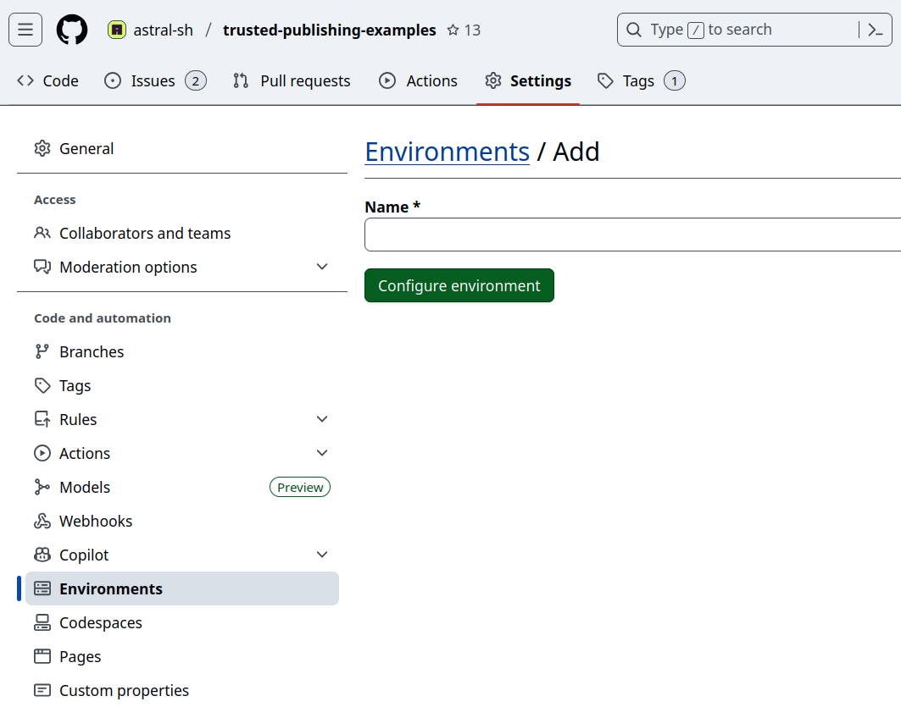

# Using uv in GitHub Actions

## Installation

For use with GitHub Actions, we recommend the official
[`astral-sh/setup-uv`](https://github.com/astral-sh/setup-uv) action, which installs uv, adds it to
PATH, (optionally) persists the cache, and more, with support for all uv-supported platforms.

To install the latest version of uv:

```yaml title="example.yml" hl_lines="11 12"
name: Example

jobs:
  uv-example:
    name: python
    runs-on: ubuntu-latest

    steps:
      - uses: actions/checkout@v6

      - name: Install uv
        uses: astral-sh/setup-uv@v7
```

It is considered best practice to pin to a specific uv version, e.g., with:

```yaml title="example.yml" hl_lines="14 15"
name: Example

jobs:
  uv-example:
    name: python
    runs-on: ubuntu-latest

    steps:
      - uses: actions/checkout@v6

      - name: Install uv
        uses: astral-sh/setup-uv@v7
        with:
          # Install a specific version of uv.
          version: "0.10.4"
```

## Setting up Python

Python can be installed with the `python install` command:

```yaml title="example.yml" hl_lines="14 15"
name: Example

jobs:
  uv-example:
    name: python
    runs-on: ubuntu-latest

    steps:
      - uses: actions/checkout@v6

      - name: Install uv
        uses: astral-sh/setup-uv@v7

      - name: Set up Python
        run: uv python install
```

This will respect the Python version pinned in the project.

Alternatively, the official GitHub `setup-python` action can be used. This can be faster, because
GitHub caches the Python versions alongside the runner.

Set the
[`python-version-file`](https://github.com/actions/setup-python/blob/main/docs/advanced-usage.md#using-the-python-version-file-input)
option to use the pinned version for the project:

```yaml title="example.yml" hl_lines="14"
name: Example

jobs:
  uv-example:
    name: python
    runs-on: ubuntu-latest

    steps:
      - uses: actions/checkout@v6

      - name: "Set up Python"
        uses: actions/setup-python@v6
        with:
          python-version-file: ".python-version"

      - name: Install uv
        uses: astral-sh/setup-uv@v7
```

Or, specify the `pyproject.toml` file to ignore the pin and use the latest version compatible with
the project's `requires-python` constraint:

```yaml title="example.yml" hl_lines="14"
name: Example

jobs:
  uv-example:
    name: python
    runs-on: ubuntu-latest

    steps:
      - uses: actions/checkout@v6

      - name: "Set up Python"
        uses: actions/setup-python@v6
        with:
          python-version-file: "pyproject.toml"

      - name: Install uv
        uses: astral-sh/setup-uv@v7
```

## Multiple Python versions

When using a matrix to test multiple Python versions, set the Python version using
`astral-sh/setup-uv`, which will override the Python version specification in the `pyproject.toml`
or `.python-version` files:

```yaml title="example.yml" hl_lines="17 18"
jobs:
  build:
    name: continuous-integration
    runs-on: ubuntu-latest
    strategy:
      matrix:
        python-version:
          - "3.10"
          - "3.11"
          - "3.12"

    steps:
      - uses: actions/checkout@v6

      - name: Install uv and set the Python version
        uses: astral-sh/setup-uv@v7
        with:
          python-version: ${{ matrix.python-version }}
```

If not using the `setup-uv` action, you can set the `UV_PYTHON` environment variable:

```yaml title="example.yml" hl_lines="12"
jobs:
  build:
    name: continuous-integration
    runs-on: ubuntu-latest
    strategy:
      matrix:
        python-version:
          - "3.10"
          - "3.11"
          - "3.12"
    env:
      UV_PYTHON: ${{ matrix.python-version }}
    steps:
      - uses: actions/checkout@v6
```

## Syncing and running

Once uv and Python are installed, the project can be installed with `uv sync` and commands can be
run in the environment with `uv run`:

```yaml title="example.yml" hl_lines="15 17-22"
name: Example

jobs:
  uv-example:
    name: python
    runs-on: ubuntu-latest

    steps:
      - uses: actions/checkout@v6

      - name: Install uv
        uses: astral-sh/setup-uv@v7

      - name: Install the project
        run: uv sync --locked --all-extras --dev

      - name: Run tests
        # For example, using `pytest`
        run: uv run pytest tests
```

!!! tip

    The
    [`UV_PROJECT_ENVIRONMENT` setting](../../concepts/projects/config.md#project-environment-path) can
    be used to install to the system Python environment instead of creating a virtual environment.

## Caching

It may improve CI times to store uv's cache across workflow runs.

The [`astral-sh/setup-uv`](https://github.com/astral-sh/setup-uv) has built-in support for
persisting the cache:

```yaml title="example.yml"
- name: Enable caching
  uses: astral-sh/setup-uv@v7
  with:
    enable-cache: true
```

Alternatively, you can manage the cache manually with the `actions/cache` action:

```yaml title="example.yml"
jobs:
  install_job:
    env:
      # Configure a constant location for the uv cache
      UV_CACHE_DIR: /tmp/.uv-cache

    steps:
      # ... setup up Python and uv ...

      - name: Restore uv cache
        uses: actions/cache@v5
        with:
          path: /tmp/.uv-cache
          key: uv-${{ runner.os }}-${{ hashFiles('uv.lock') }}
          restore-keys: |
            uv-${{ runner.os }}-${{ hashFiles('uv.lock') }}
            uv-${{ runner.os }}

      # ... install packages, run tests, etc ...

      - name: Minimize uv cache
        run: uv cache prune --ci
```

The `uv cache prune --ci` command is used to reduce the size of the cache and is optimized for CI.
Its effect on performance is dependent on the packages being installed.

!!! tip

    If using `uv pip`, use `requirements.txt` instead of `uv.lock` in the cache key.

!!! note

    [post-job-hook]: https://docs.github.com/en/actions/hosting-your-own-runners/managing-self-hosted-runners/running-scripts-before-or-after-a-job

    When using non-ephemeral, self-hosted runners the default cache directory can grow unbounded.
    In this case, it may not be optimal to share the cache between jobs. Instead, move the cache
    inside the GitHub Workspace and remove it once the job finishes using a
    [Post Job Hook][post-job-hook].

    ```yaml
    install_job:
      env:
        # Configure a relative location for the uv cache
        UV_CACHE_DIR: ${{ github.workspace }}/.cache/uv
    ```

    Using a post job hook requires setting the `ACTIONS_RUNNER_HOOK_JOB_STARTED` environment
    variable on the self-hosted runner to the path of a cleanup script such as the one shown below.

    ```sh title="clean-uv-cache.sh"
    #!/usr/bin/env sh
    uv cache clean
    ```

## Using `uv pip`

If using the `uv pip` interface instead of the uv project interface, uv requires a virtual
environment by default. To allow installing packages into the system environment, use the `--system`
flag on all `uv` invocations or set the `UV_SYSTEM_PYTHON` variable.

The `UV_SYSTEM_PYTHON` variable can be defined in at different scopes.

Opt-in for the entire workflow by defining it at the top level:

```yaml title="example.yml"
env:
  UV_SYSTEM_PYTHON: 1

jobs: ...
```

Or, opt-in for a specific job in the workflow:

```yaml title="example.yml"
jobs:
  install_job:
    env:
      UV_SYSTEM_PYTHON: 1
    ...
```

Or, opt-in for a specific step in a job:

```yaml title="example.yml"
steps:
  - name: Install requirements
    run: uv pip install -r requirements.txt
    env:
      UV_SYSTEM_PYTHON: 1
```

To opt-out again, the `--no-system` flag can be used in any uv invocation.

## Private repos

If your project has [dependencies](../../concepts/projects/dependencies.md#git) on private GitHub
repositories, you will need to configure a [personal access token (PAT)][PAT] to allow uv to fetch
them.

After creating a PAT that has read access to the private repositories, add it as a [repository
secret].

Then, you can use the [`gh`](https://cli.github.com/) CLI (which is installed in GitHub Actions
runners by default) to configure a
[credential helper for Git](../../concepts/authentication/git.md#git-credential-helpers) to use the
PAT for queries to repositories hosted on `github.com`.

For example, if you called your repository secret `MY_PAT`:

```yaml title="example.yml"
steps:
  - name: Register the personal access token
    run: echo "${{ secrets.MY_PAT }}" | gh auth login --with-token
  - name: Configure the Git credential helper
    run: gh auth setup-git
```

[PAT]:
  https://docs.github.com/en/authentication/keeping-your-account-and-data-secure/managing-your-personal-access-tokens
[repository secret]:
  https://docs.github.com/en/actions/security-for-github-actions/security-guides/using-secrets-in-github-actions#creating-secrets-for-a-repository

## Publishing to PyPI

uv can be used to build and publish your package to PyPI from GitHub Actions. We provide a
standalone example alongside this guide in
[astral-sh/trusted-publishing-examples](https://github.com/astral-sh/trusted-publishing-examples).
The workflow uses [trusted publishing](https://docs.pypi.org/trusted-publishers/), so no credentials
need to be configured.

In the example workflow, we use a script to test that the source distribution and the wheel are both
functional and we didn't miss any files. This step is recommended, but optional.

First, add a release workflow to your project:

```yaml title=".github/workflows/publish.yml"
name: "Publish"

on:
  push:
    tags:
      # Publish on any tag starting with a `v`, e.g., v0.1.0
      - v*

jobs:
  run:
    runs-on: ubuntu-latest
    environment:
      name: pypi
    permissions:
      id-token: write
      contents: read
    steps:
      - name: Checkout
        uses: actions/checkout@v6
      - name: Install uv
        uses: astral-sh/setup-uv@v7
      - name: Install Python 3.13
        run: uv python install 3.13
      - name: Build
        run: uv build
      # Check that basic features work and we didn't miss to include crucial files
      - name: Smoke test (wheel)
        run: uv run --isolated --no-project --with dist/*.whl tests/smoke_test.py
      - name: Smoke test (source distribution)
        run: uv run --isolated --no-project --with dist/*.tar.gz tests/smoke_test.py
      - name: Publish
        run: uv publish
```

Then, create the environment defined in the workflow in the GitHub repository under "Settings" ->
"Environments".



Add a [trusted publisher](https://docs.pypi.org/trusted-publishers/adding-a-publisher/) to your PyPI
project in the project settings under "Publishing". Ensure that all fields match with your GitHub
configuration.


After saving:


Finally, tag a release and push it. Make sure it starts with `v` to match the pattern in the
workflow.

```console
$ git tag -a v0.1.0 -m v0.1.0
$ git push --tags
```
