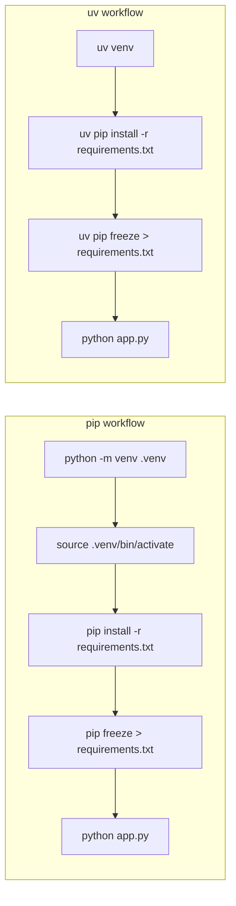

# Migrating from pip to uv

This guide covers replacing `pip` and `pip-tools` commands with their `uv` equivalents. For
migrating a pip-based project to uv's project interface, see
[Migrating from pip to a uv project](./pip-to-project.md).

## Command mapping

### Package installation

| pip | uv |
| --- | --- |
| `pip install flask` | `uv pip install flask` |
| `pip install flask==3.0.0` | `uv pip install flask==3.0.0` |
| `pip install -r requirements.txt` | `uv pip install -r requirements.txt` |
| `pip install -e .` | `uv pip install -e .` |
| `pip install --upgrade flask` | `uv pip install --upgrade flask` |

### Package removal

| pip | uv |
| --- | --- |
| `pip uninstall flask` | `uv pip uninstall flask` |
| `pip uninstall -r requirements.txt` | `uv pip uninstall -r requirements.txt` |

### Inspecting packages

| pip | uv |
| --- | --- |
| `pip list` | `uv pip list` |
| `pip show flask` | `uv pip show flask` |
| `pip freeze` | `uv pip freeze` |
| `pip check` | `uv pip check` |

### pip-tools

| pip-tools | uv |
| --- | --- |
| `pip-compile requirements.in` | `uv pip compile requirements.in` |
| `pip-compile --generate-hashes` | `uv pip compile --generate-hashes` |
| `pip-sync requirements.txt` | `uv pip sync requirements.txt` |

### Virtual environments

| pip / venv | uv |
| --- | --- |
| `python -m venv .venv` | `uv venv` |
| `python -m venv --python 3.12 .venv` | `uv venv --python 3.12` |
| `source .venv/bin/activate && pip install flask` | `uv pip install flask` (auto-detects `.venv`) |

## Key differences

**No activation required.** uv detects the `.venv` in the current directory automatically. You
don't need to activate the virtual environment before running `uv pip` commands.

**Faster.** uv uses a global cache and parallel downloads. Expect 10-100x faster installs on warm
cache.

**Universal resolution.** `uv pip compile --universal` generates a single lockfile that works
across platforms — no need for per-platform requirements files.

**Stricter by default.** uv won't install into the system Python unless you pass `--system`. This
prevents accidental pollution of global environments.

## Workflow comparison

## Gotchas

- `uv pip install` requires an active virtual environment (or `--system`). If there's no `.venv` in
  the working directory and no `VIRTUAL_ENV` set, it will error rather than silently installing into
  the system Python.
- `uv pip compile` produces universal output by default when using `--universal`. Without it, the
  output is platform-specific, matching pip-tools behavior.
- Hash-checking mode works the same way: `uv pip compile --generate-hashes` and
  `uv pip install --require-hashes`.
