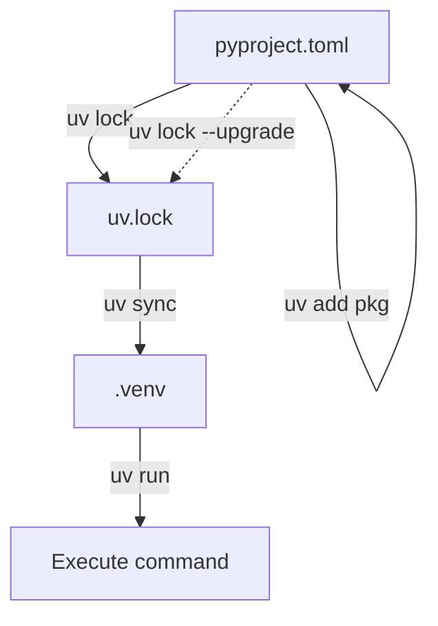
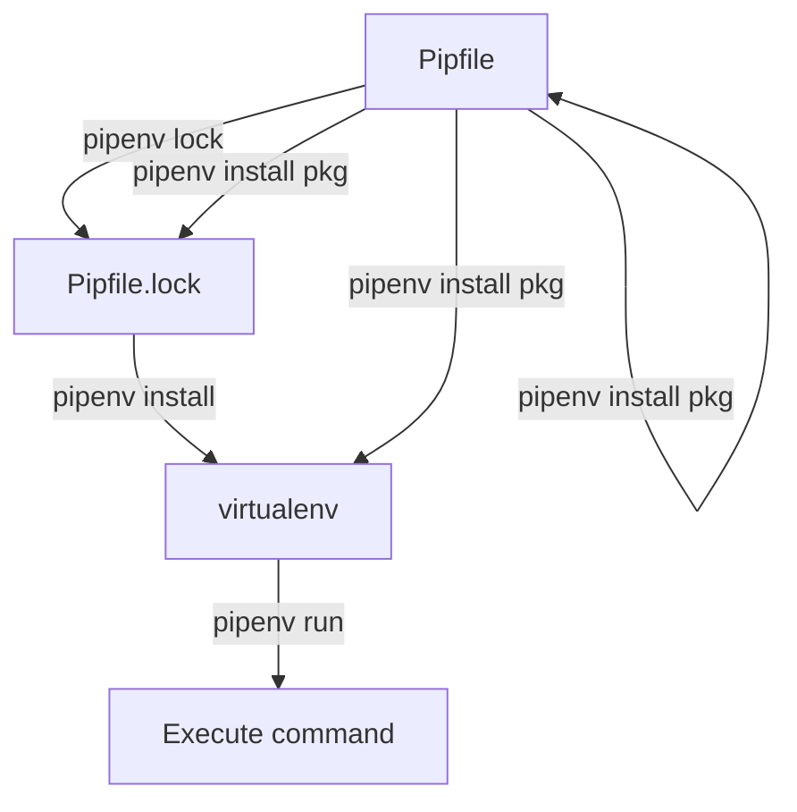

# Migrating from Pipenv to uv

This guide covers converting a Pipenv project to uv. Pipenv uses `Pipfile` and `Pipfile.lock`; uv
uses `pyproject.toml` and `uv.lock`.

## Command mapping

| Pipenv | uv | Notes |
| --- | --- | --- |
| `pipenv install` | `uv sync` | Install from lockfile |
| `pipenv install flask` | `uv add flask` | |
| `pipenv install pytest --dev` | `uv add pytest --dev` | |
| `pipenv uninstall flask` | `uv remove flask` | |
| `pipenv update` | `uv lock --upgrade && uv sync` | |
| `pipenv lock` | `uv lock` | |
| `pipenv run pytest` | `uv run pytest` | |
| `pipenv shell` | `source .venv/bin/activate` | uv doesn't have a shell command |
| `pipenv graph` | `uv tree` | |
| `pipenv check` | `uv pip check` | After `uv sync` |
| `pipenv --python 3.12` | `uv python pin 3.12` | |
| `pipenv --rm` | `rm -rf .venv` | |

## Converting from Pipfile

### Before (Pipfile)

```toml
[[source]]
url = "https://pypi.org/simple"
verify_ssl = true
name = "pypi"

[packages]
flask = ">=3.0"
sqlalchemy = {version = ">=2.0", extras = ["asyncio"]}
requests = "*"

[dev-packages]
pytest = ">=8.0"
ruff = "*"

[requires]
python_version = "3.12"
```

### After (pyproject.toml)

```toml
[project]
name = "myapp"
version = "0.1.0"
requires-python = ">=3.12"
dependencies = [
    "flask>=3.0",
    "sqlalchemy[asyncio]>=2.0",
    "requests",
]

[dependency-groups]
dev = ["pytest>=8.0", "ruff"]

[build-system]
requires = ["hatchling"]
build-backend = "hatchling.build"
```

### What changed

- `[packages]` becomes `[project.dependencies]`.
- `[dev-packages]` becomes `[dependency-groups] dev`.
- `"*"` (any version) becomes an unpinned dependency — just list the package name.
- `[requires] python_version` becomes `requires-python`.
- The `[[source]]` section is removed if using the default PyPI. Custom indexes go in
  `[[tool.uv.index]]`.

## Step-by-step migration

1. **Create a `pyproject.toml`** — either manually or with uv:

    ```console
    $ uv init
    ```

2. **Add your dependencies.** You can read them from the Pipfile or add them one at a time:

    ```console
    $ uv add flask "sqlalchemy[asyncio]" requests
    $ uv add --dev pytest ruff
    ```

3. **Generate the lockfile:**

    ```console
    $ uv lock
    ```

4. **Install:**

    ```console
    $ uv sync
    ```

5. **Remove Pipenv artifacts:**

    ```console
    $ rm Pipfile Pipfile.lock
    ```

6. **Verify:**

    ```console
    $ uv run pytest
    ```

## Dependency resolution flow

The following diagram shows how uv resolves and installs dependencies:



Compare this with the Pipenv flow:



The key difference: uv separates locking (`uv lock`) from syncing (`uv sync`). Adding a dependency
with `uv add` updates `pyproject.toml` and the lockfile, but `uv sync` or `uv run` is needed to
install. This gives you more control and makes the operations predictable.

## Handling Pipfile features

### Custom indexes

Pipfile:

```toml
[[source]]
url = "https://pypi.example.com/simple/"
verify_ssl = true
name = "private"
```

uv:

```toml
[[tool.uv.index]]
name = "private"
url = "https://pypi.example.com/simple/"
```

### Python version

Pipfile:

```toml
[requires]
python_version = "3.12"
```

uv:

```toml
[project]
requires-python = ">=3.12"
```

Or pin to an exact version with:

```console
$ uv python pin 3.12
```

### Environment variables

Pipenv loads `.env` files automatically. uv does not. Use `uv run` with your preferred env loader,
or set variables in your shell before running commands:

```console
$ env $(cat .env | xargs) uv run python app.py
```

Or use a tool like [direnv](https://direnv.net/) or
[python-dotenv](https://pypi.org/project/python-dotenv/).

## What you gain

- **Speed.** uv is 10-100x faster for installs and resolution.
- **Universal lockfile.** `uv.lock` resolves for all platforms at once. Pipenv's `Pipfile.lock` is
  platform-specific.
- **Standards-based.** `pyproject.toml` with PEP 621 metadata works with any Python tooling, not
  just Pipenv.
- **Built-in Python management.** `uv python install 3.12` — no need for pyenv alongside Pipenv.
- **Deterministic.** Separate lock and sync steps make the process transparent.
