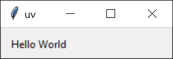
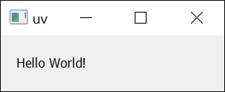

# Running scripts

A Python script is a file intended for standalone execution, e.g., with `python <script>.py`. Using
uv to execute scripts ensures that script dependencies are managed without manually managing
environments.

!!! note

    If you are not familiar with Python environments: every Python installation has an environment
    that packages can be installed in. Typically, creating [_virtual_ environments](https://docs.python.org/3/library/venv.html) is recommended to
    isolate packages required by each script. uv automatically manages virtual environments for you
    and prefers a [declarative](#declaring-script-dependencies) approach to dependencies.

## Running a script without dependencies

If your script has no dependencies, you can execute it with `uv run`:

```python title="example.py"
print("Hello world")
```

```console
$ uv run example.py
Hello world
```

<!-- TODO(zanieb): Once we have a `python` shim, note you can execute it with `python` here -->

Similarly, if your script depends on a module in the standard library, there's nothing more to do:

```python title="example.py"
import os

print(os.path.expanduser("~"))
```

```console
$ uv run example.py
/Users/astral
```

Arguments may be provided to the script:

```python title="example.py"
import sys

print(" ".join(sys.argv[1:]))
```

```console
$ uv run example.py test
test

$ uv run example.py hello world!
hello world!
```

Additionally, your script can be read directly from stdin:

```console
$ echo 'print("hello world!")' | uv run -
```

Or, if your shell supports [here-documents](https://en.wikipedia.org/wiki/Here_document):

```bash
uv run - <<EOF
print("hello world!")
EOF
```

Note that if you use `uv run` in a _project_, i.e. a directory with a `pyproject.toml`, it will
install the current project before running the script. If your script does not depend on the
project, use the `--no-project` flag to skip this:

```console
$ # Note, it is important that the flag comes _before_ the script
$ uv run --no-project example.py
```

See the [projects guide](./projects.md) for more details on working in projects.

## Running a script with dependencies

When your script requires other packages, they must be installed into the environment that the
script runs in. uv prefers to create these environments on-demand instead of using a long-lived
virtual environment with manually managed dependencies. This requires explicit declaration of
dependencies that are required for the script. Generally, it's recommended to use a
[project](./projects.md) or [inline metadata](#declaring-script-dependencies) to declare
dependencies, but uv supports requesting dependencies per invocation as well.

For example, the following script requires `rich`.

```python title="example.py"
import time
from rich.progress import track

for i in track(range(20), description="For example:"):
    time.sleep(0.05)
```

If executed without specifying a dependency, this script will fail:

```console
$ uv run --no-project example.py
Traceback (most recent call last):
  File "/Users/astral/example.py", line 2, in <module>
    from rich.progress import track
ModuleNotFoundError: No module named 'rich'
```

Request the dependency using the `--with` option:

```console
$ uv run --with rich example.py
For example: ━━━━━━━━━━━━━━━━━━━━━━━━━━━━━━━━━━━━━━━━ 100% 0:00:01
```

Constraints can be added to the requested dependency if specific versions are needed:

```console
$ uv run --with 'rich>12,<13' example.py
```

Multiple dependencies can be requested by repeating with `--with` option.

Note that if `uv run` is used in a _project_, these dependencies will be included _in addition_ to
the project's dependencies. To opt-out of this behavior, use the `--no-project` flag.

## Creating a Python script

Python recently added a standard format for
[inline script metadata](https://packaging.python.org/en/latest/specifications/inline-script-metadata/#inline-script-metadata).
It allows for selecting Python versions and defining dependencies. Use `uv init --script` to
initialize scripts with the inline metadata:

```console
$ uv init --script example.py --python 3.12
```

## Declaring script dependencies

The inline metadata format allows the dependencies for a script to be declared in the script itself.

uv supports adding and updating inline script metadata for you. Use `uv add --script` to declare the
dependencies for the script:

```console
$ uv add --script example.py 'requests<3' 'rich'
```

This will add a `script` section at the top of the script declaring the dependencies using TOML:

```python title="example.py"
# /// script
# dependencies = [
#   "requests<3",
#   "rich",
# ]
# ///

import requests
from rich.pretty import pprint

resp = requests.get("https://peps.python.org/api/peps.json")
data = resp.json()
pprint([(k, v["title"]) for k, v in data.items()][:10])
```

uv will automatically create an environment with the dependencies necessary to run the script, e.g.:

```console
$ uv run example.py
[
│   ('1', 'PEP Purpose and Guidelines'),
│   ('2', 'Procedure for Adding New Modules'),
│   ('3', 'Guidelines for Handling Bug Reports'),
│   ('4', 'Deprecation of Standard Modules'),
│   ('5', 'Guidelines for Language Evolution'),
│   ('6', 'Bug Fix Releases'),
│   ('7', 'Style Guide for C Code'),
│   ('8', 'Style Guide for Python Code'),
│   ('9', 'Sample Plaintext PEP Template'),
│   ('10', 'Voting Guidelines')
]
```

!!! important

    When using inline script metadata, even if `uv run` is [used in a _project_](../concepts/projects.md#running-scripts), the project's dependencies will be ignored. The `--no-project` flag is not required.

uv also respects Python version requirements:

```python title="example.py"
# /// script
# requires-python = ">=3.12"
# dependencies = []
# ///

# Use some syntax added in Python 3.12
type Point = tuple[float, float]
print(Point)
```

!!! note

    The `dependencies` field must be provided even if empty.

`uv run` will search for and use the required Python version. The Python version will download if it
is not installed — see the documentation on [Python versions](../concepts/python-versions.md) for
more details.

## Improving reproducibility

uv supports an `exclude-newer` field in the `tool.uv` section of inline script metadata to limit uv
to only considering distributions released before a specific date. This is useful for improving the
reproducibility of your script when run at a later point in time.

The date must be specified as an [RFC 3339](https://www.rfc-editor.org/rfc/rfc3339.html) timestamp
(e.g., `2006-12-02T02:07:43Z`).

```python title="example.py"
# /// script
# dependencies = [
#   "requests",
# ]
# [tool.uv]
# exclude-newer = "2023-10-16T00:00:00Z"
# ///

import requests

print(requests.__version__)
```

## Using different Python versions

uv allows arbitrary Python versions to be requested on each script invocation, for example:

```python title="example.py"
import sys

print(".".join(map(str, sys.version_info[:3])))
```

```console
$ # Use the default Python version, may differ on your machine
$ uv run example.py
3.12.6
```

```console
$ # Use a specific Python version
$ uv run --python 3.10 example.py
3.10.15
```

See the [Python version request](../concepts/python-versions.md#requesting-a-version) documentation
for more details on requesting Python versions.

## Using GUI scripts

On Windows `uv` will run your script ending with `.pyw` extension using `pythonw`:

```python title="example.pyw"
from tkinter import Tk, ttk

root = Tk()
root.title("uv")
frm = ttk.Frame(root, padding=10)
frm.grid()
ttk.Label(frm, text="Hello World").grid(column=0, row=0)
root.mainloop()
```

```console
PS> uv run example.pyw
```

{: style="height:50px;width:150px"}

Similarly, it works with dependencies as well:

```python title="example_pyqt.pyw"
import sys
from PyQt5.QtWidgets import QApplication, QWidget, QLabel, QGridLayout

app = QApplication(sys.argv)
widget = QWidget()
grid = QGridLayout()

text_label = QLabel()
text_label.setText("Hello World!")
grid.addWidget(text_label)

widget.setLayout(grid)
widget.setGeometry(100, 100, 200, 50)
widget.setWindowTitle("uv")
widget.show()
sys.exit(app.exec_())
```

```console
PS> uv run --with PyQt5 example_pyqt.pyw
```

{: style="height:50px;width:150px"}

## Next steps

To learn more about `uv run`, see the [command reference](../reference/cli.md#uv-run).

Or, read on to learn how to [run and install tools](./tools.md) with uv.
